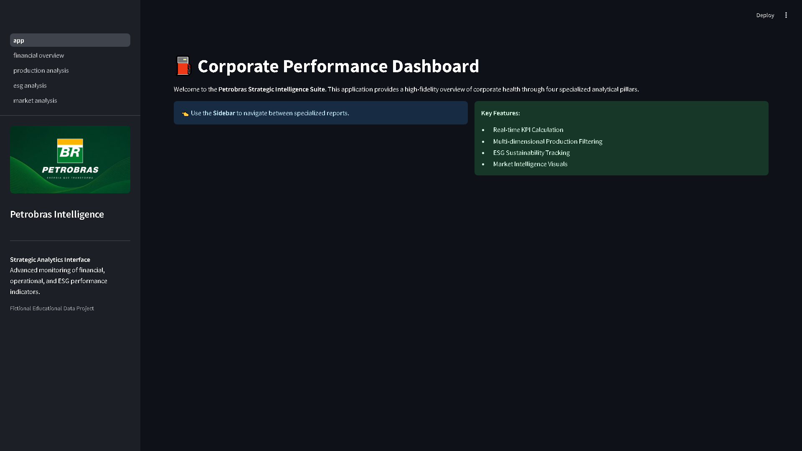
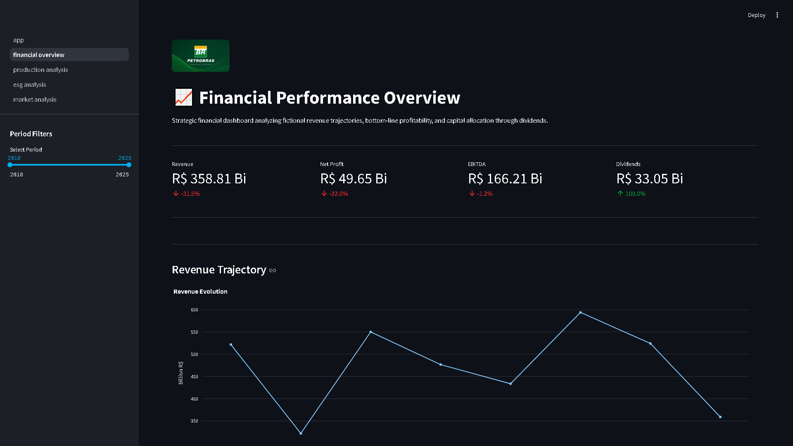
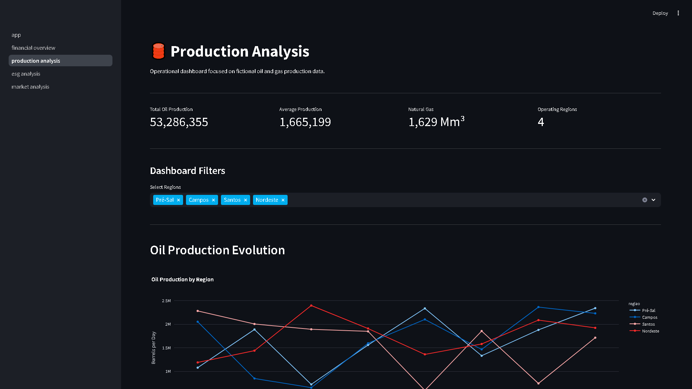
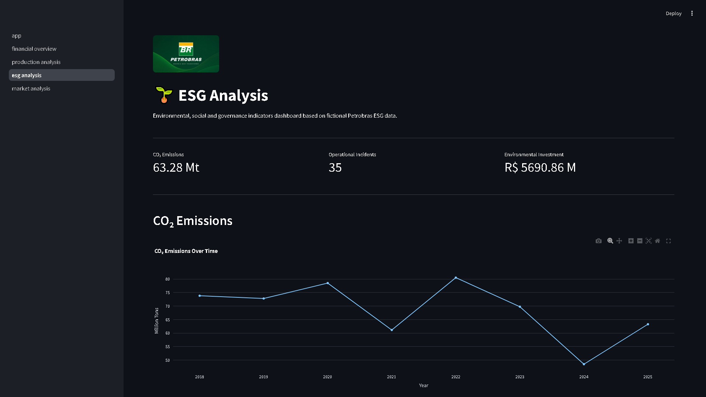
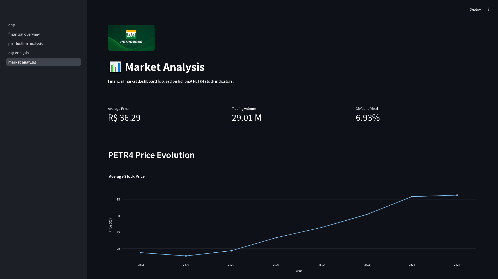

Petrobras Analytics Dashboard

Interactive dashboard for fictional Petrobras financial, operational and ESG data analysis built with Streamlit, Pandas and Plotly.

Overview:

This project was developed to simulate a real-world business intelligence and data analytics environment using fictional datasets inspired by the Brazilian energy sector.

The dashboard provides interactive visualizations and KPI monitoring for:

Financial performance
Oil and gas production
ESG indicators
Market analytics

The main goal of the project is to demonstrate practical skills in:

Data analysis
Data visualization
Dashboard development
Python modularization
Business intelligence concepts
Git/GitHub workflow

Technologies Used:

Python
Streamlit
Pandas
Plotly
OpenPyXL

Features:

Financial Analysis:

Revenue analysis
Net profit monitoring
EBITDA indicators
Dividend analysis

Production Analysis:

Oil production monitoring
Natural gas indicators
Regional production comparison

ESG Dashboard:

CO₂ emissions analysis
Environmental investments
Operational incidents tracking

Interactive Dashboard:

Dynamic charts
KPI cards
Sidebar navigation
Responsive layout

Project Structure:

petrobras-dashboard/
│
├── app.py
├── requirements.txt
├── README.md
├── .gitignore
│
├── data/
│   └── petrobras_dados_ficticios.xlsx
│
├── pages/
│   ├── 1_financial_overview.py
│   ├── 2_production_analysis.py
│   └── 3_esg_analysis.py
│
├── utils/
│   ├── load_data.py
│   ├── charts.py
│   ├── kpis.py
│   └── formatting.py
│
├── assets/
│   └── logo.png
│
└── .streamlit/
    └── config.toml
Dashboard Preview

## App overview

## Financial Overview

## Production Analytics

## ESG Analysis

## Market Analytics

Installation

Clone the repository:

git clone https://github.com/YOUR_USERNAME/petrobras-analytics-dashboard.git

Access the project folder:

cd petrobras-analytics-dashboard

Install dependencies:

pip install -r requirements.txt

Run the application:

streamlit run app.py
Dataset

This project uses a fictional dataset created exclusively for educational and portfolio purposes.

The data does not represent real operational or financial information from Petrobras.

Main Skills Demonstrated
Exploratory Data Analysis (EDA)
Dashboard Design
Interactive Visualization
KPI Development
Data Processing with Pandas
Python Project Organization
Git and GitHub Workflow
Streamlit Application Development
Future Improvements
Machine Learning forecasting
PETR4 stock analysis
Real-time API integration
Advanced filtering system
Database integration
Docker deployment
Author

Developed by Alexandre Soares Neves Junior

GitHub: https://github.com/Alexandre1101

License

This project is intended for educational and portfolio purposes only.